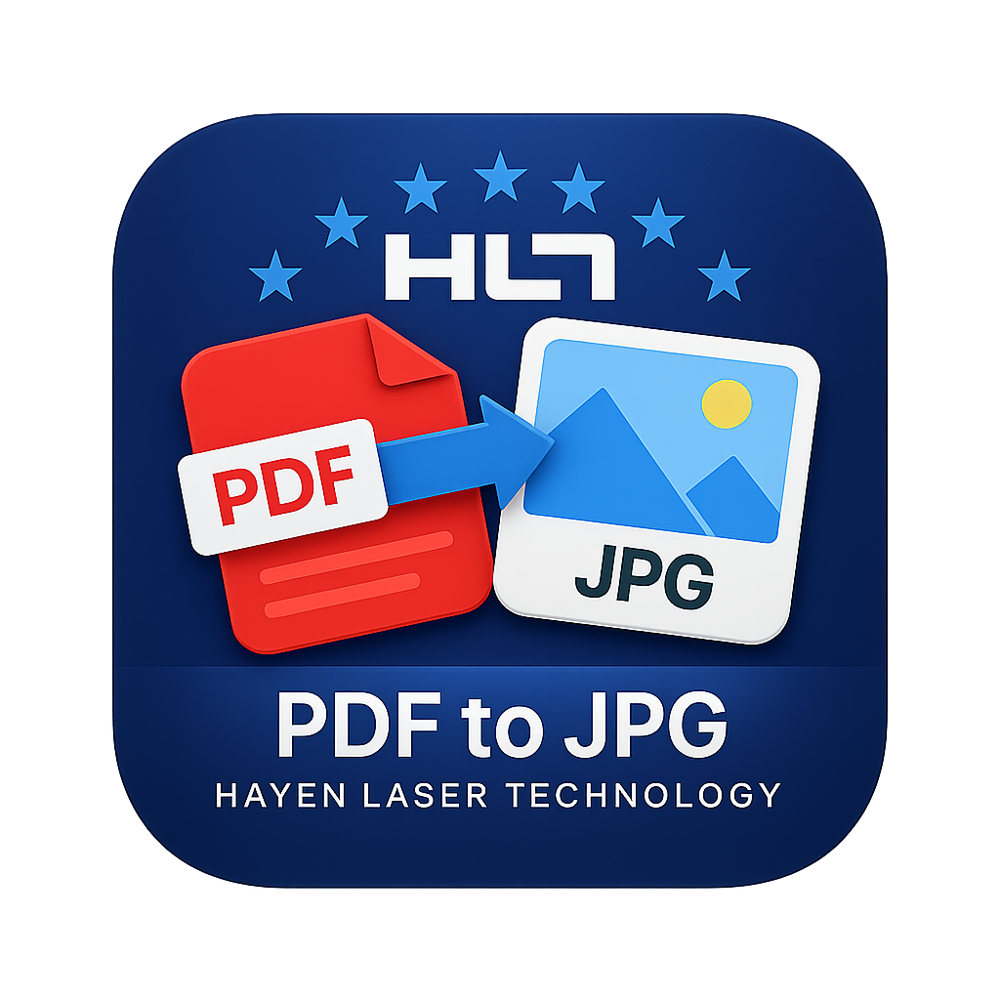

# PDF to JPG Converter

A clean, fast Windows desktop app that converts PDF files to JPEG images. Built with WPF on .NET 8, powered by the PDFium rendering engine.



---

## Features

- **Drag & drop** PDF files directly onto the app, or use the file picker
- **Batch conversion** — add multiple PDFs and convert them all at once
- **High-quality output** — configurable DPI (72–1200) and JPEG quality (10–100%)
- **Color modes** — Color, Grayscale, or Black & White output
- **Landscape rotation** — automatically rotates wide pages 90° CCW to portrait
- **Flexible output location** — save to a custom folder or next to each source PDF
- **Subfolder per PDF** — optionally group pages into a named subfolder
- **Auto-open output folder** — opens Explorer automatically after conversion (custom folder mode only)
- **Dark / Light theme** — toggle in Settings, remembered on restart
- **Persistent settings** — all settings (DPI, quality, theme, folder, etc.) are saved between sessions
- **Frameless modern UI** — rounded corners, minimal chrome

---

## Output file naming

Pages are saved as `<PDFName>_001.jpg`, `<PDFName>_002.jpg`, etc. in the chosen output directory.

---

## Requirements

- Windows 10 or later (x64)
- [.NET 8 Desktop Runtime](https://dotnet.microsoft.com/en-us/download/dotnet/8.0) (x64)

---

## Installation

Download `PdfToJpgConverter_Setup_v1.2.exe` from the [Releases](../../releases) page and run it.

The installer:
- Checks for the .NET 8 Desktop Runtime and guides you to install it if missing
- Places the app in `%LocalAppData%\PDF to JPG Converter` (no admin rights needed)
- Optionally creates a desktop shortcut
- Includes an uninstaller

---

## Building from source

Prerequisites: [.NET 8 SDK](https://dotnet.microsoft.com/download/dotnet/8.0)

```bash
# Debug build
dotnet build src/

# Release build
dotnet build src/ -c Release

# Framework-dependent publish (requires .NET 8 Desktop Runtime on target machine)
dotnet publish src/ -c Release --no-self-contained -o publish
```

The PDFium native DLLs (`x64/pdfium.dll`, `x86/pdfium.dll`, `icudt.dll`) are pulled from the `PDFium.Net.SDK` NuGet package and copied automatically during build.

---

## Settings

Open the settings panel via the gear icon (top-right). Available options:

| Setting | Description |
|---|---|
| Dark mode | Toggle between dark and light theme |
| Color mode | Color / Grayscale / B&W output |
| Output DPI | Resolution of exported images (default 300) |
| JPEG Quality | Compression quality, 10–100% (default 95%) |
| Rotate landscape | Auto-rotates wide pages to portrait |
| Create subfolder per PDF | Groups pages into a named subfolder |
| Default export folder | Folder used when "Custom folder" mode is active |

All settings are saved automatically and restored on the next launch.

---

## Tech stack

| Component | Details |
|---|---|
| UI framework | WPF (.NET 8, `net8.0-windows`) |
| PDF rendering | [PDFium.Net.SDK](https://www.nuget.org/packages/PDFium.Net.SDK/) (Patagames, v4.6.x) |
| Image processing | `System.Drawing.Common` |
| Settings | `System.Text.Json` → `%AppData%\PdfToJpgConverter\settings.json` |
| Installer | [Inno Setup 6](https://jrsoftware.org/isinfo.php) (framework-dependent) |

---

## License

This project is provided as-is for personal use. The PDFium library is subject to its own [BSD-style license](https://pdfium.googlesource.com/pdfium/+/refs/heads/main/LICENSE).

---

*PDF to JPG Converter v1.2 — by HMZ*
